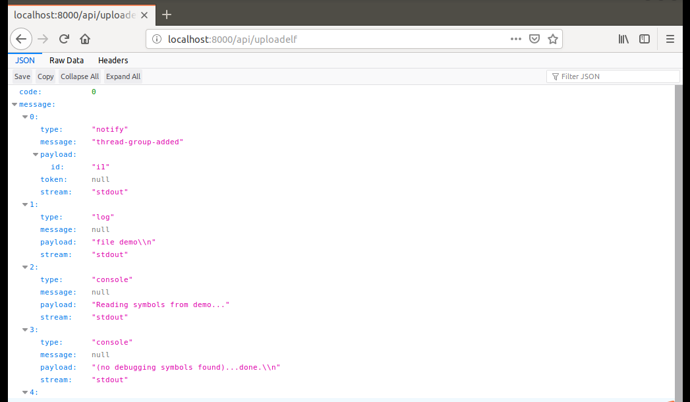

# intro

系统调用 - 科创项目

## 1. 需求分析

1. 将`gdb`调试过程进行可视化展示。

2. 单步调试并判断**系统调用**。

3. 主要用于教学演示和实验。

## 2. 技术分析

### 初期技术分析

本项目主要基于`python`语言，并采用`gdb`、`ptrace`、`web`等技术进行实现。

- 通过`gdb`的`python`扩展插件，实现在`python`中调用`gdb`，并获取`gdb`调试`elf`程序的过程和结果。

- 通过`ptrace`单步执行程序，检测并获取系统调用。

- 通过`web`实现项目的展示。前后端进行分离，前端使用`vue`+`bootstrap`框架，后端使用`django`框架。

### 中期技术分析 1.0

- 放弃`ptrace`，检测系统调用改由`gdb`中的`catch`命令来实现。

- `api`接口直接返回`json`化数据，放弃使用`rest-framework`。

- 需要在`gdb`中实现一个简单服务器，用于与`Django`服务器通信。总体形成 `gdb server -- django backend -- web fontend` 三位一体的架构。

### 中期技术分析 2.0

- 放弃`ptrace`，检测系统调用改由`gdb`中的`catch`命令来实现。

- `api`接口直接返回`json`化数据，放弃使用`rest-framework`。

- 为了避免重复造轮子，决定用别人已实现的模块`pygdbmi`来代替`gdbserver`，即用`pygdbmi`来实现Django与gdb的通讯。

### 后期技术分析

- 使用websocket进行前后端通信

- 考虑到服务器运行程序可能存在安全漏洞，后期决定整合前后端，方便本地化部署

## 3. 具体计划和进展

### 寒假阶段 2019/1 ~ 2019/2

详情见[寒假规划文档](./winHolidayPlan.md)

### 第一次开会 2019/3/12

| 具体任务 | 开始时间 | 完成时间 | 负责人 | 备注 | 完成情况 |
|---|---|---|---|---|---|
| 接口文档 | 2019/3/12 | 2019/3/14 | douNine | 大家讨论 | [api文档](./apiDoc.md)|
| 前端 | 2019/3/12 | 2019/3/20+ | TayMarine+douNine | 只实现了简单的展示 | [gdbweb](https://github.com/gu-team/gdbweb) |
| 后端 | 2019/3/12 | 2019/3/20+ | 40m41h42t+Creedowl+douNine | django实现api接口的demo | [djangoDemo](https://github.com/gu-team/djangoDemo) |

### 第二次开会 2019/3/22

会议内容：

- 展示了前端的简单界面；
- 讨论如何实现系统调用，以及`ptrace`的使用。

新阶段规划：

| 具体任务 | 开始时间 | 完成时间 | 负责人 | 备注 | 完成情况 |
|---|---|---|---|---|---|
| 前端继续完善页面 | 2019/3/22 | 2019/3/30+ | TayMarine+douNine | | [gdbweb](https://github.com/gu-team/gdbweb) |
| 后端开始实现部分接口 | 2019/3/22 | 2019/3/30+ | 40m41h42t+Creedowl+douNine | 已实现两个简单接口，直接通过`json`化返回，不使用`restful`框架 | [djangoDemo](https://github.com/gu-team/djangoDemo)中的`api`应用 |
| ptrace单步执行的demo | 2019/3/22 | 2019/3/30+ | 40m41h42t+douNine | 放弃改用`gdb`的`catch`监视系统调用 | |

### 第三次开会 2019/4/

#### 1. demo展示文档

主要展示服务端`django`与`gdb server`之间的通信：[demoDoc.md](./demoDoc.md)

#### 2. 需要讨论的问题

- `gdb`端与`django`端是否要分离成两个项目？还有，项目取啥名字呢？

- `gdb`端存在一些问题：

    - 1.`gdb`同一时刻只能运行一个文件，怎么为多个用户服务？

    - 2.`gdb`端如何记住用户之前的状态。比如，用户访问完`start`接口后，隔了一段时间，再访问`continue`接口，`gdb`怎么知道该用户有没有`start`过。如果，只为一个用户服务，可以不考虑这个问题。

- 项目`python`代码编写规范，请大师傅们指示一下。

#### 3. 新阶段的规划

##### 问题的解决

1. 后端分为`gdb`服务端: [gdbServer](https://github.com/gu-team/gdbServer) 和 `django`端: [gdbBackEnd_DJ](https://github.com/gu-team/gdbBackEnd_DJ)。

2. 现阶段测试时，只开启一个`gdb`端，即同一时刻只允许一个用户访问，后期再采用开启多个`gdb`端(多进程)。

3. 单个用户暂时不考虑缓存问题，后期可能用`redis`解决。

4. 暂时用`tcp`实现与Django的通讯，后期再改成进程间的通讯。

##### 新的分工

总而言之，先将`gdb`的基本功能都实现，再考虑之后的改进。

所以，现阶段(**下次开会之前**)需要分工完成[接口文档](./apiDoc.md)中的以下接口：

|接口|负责人|
|---|---|
|`api/start`|douNine|
|`api/continue`|douNine|
|`api/break`|douNine|
|`api/next`|Creedowl|
|`api/step`|douNine|
|`api/disassemble`|40m41h42t|
|`api/getRip`|40m41h42t|
|`api/getRegister`|TayMarine|

接口编写需要同时完成`django`端和`gdb`端的。

如何编写，以及如何测试，请参考[展示demo](./demoDoc.md)。

~~**编写完一个接口后，到[计划卡](https://github.com/orgs/gu-team/projects/1#card-19897027)中勾选已完成的`api`**。~~

### 第四次开会 2019/4/12

#### 1. 进度展示

由于取消了`gdbserver`端的开发，现在后端只需实现`django`端的即可。

所以：

进入 `gdbBackEnd_DJ` 根目录：

```py
python manage.py runserver
```

然后，打开浏览器访问接口，如下结果：



#### 2. 需要讨论的问题

暂无

#### 3. 新的分工

取消了`gdbserver`端后，后端工作相对减少，所以前后端将一起进行。

##### 3.1. 后端

继续完成[接口文档](./apiDoc.md)中的接口，规则参考接口文档，具体实现和过程可参照已实现的接口。

|接口|负责人|
|---|---|
|`api/uploadelf`|douNine|
|`api/start`|douNine|
|`api/continue`|douNine|
|`api/break`|douNine|
|`api/next`|Creedowl|
|`api/step`|Creedowl|
|`api/disassemble`|40m41h42t|
|`api/getRip`|40m41h42t|
|`api/getRegister`|TayMarine|

**编写完一个接口后，到[计划卡](https://github.com/orgs/gu-team/projects/1#card-19897027)中勾选已完成的`api`**。

##### 3.2. 前端

|任务|负责人|
|---|---|
|主页面和数据获取|douNine|
|上传文件页面和文件上传|TayMarine|

### 第五次开会 2019/7/7

#### 1. 项目现状

总体完成情况40%。

前端界面简陋、功能较少，而且没有确定一个总体的页面框架。

后面仅仅实现了几个接口，功能少得可怜。而且还存在着诸多问题，比如：没有判断用户退出而终止进程等。

总而言之，现在`gdb`基本功能还未实现，系统调用功能还未开始。可时间却剩下短短两个月。

#### 2. 需要讨论的问题

1. 项目或者说后端还需要哪些功能？

2. 前端页面应该如何设计？

3. 项目的暑期分工和规划。

#### 3. 讨论的结果

1. 后端还需要实现的接口和详情为:

|接口|功能|请求参数|返回数据|
|---|---|---|---|
|`api/step`|单步执行并进入函数|无或执行步数|返回`gdb`输出|
|`api/infoRegister`|即`gdb`命令`info registers`的功能|无|返回`gdb`输出，最好能返回对应寄存器的字典序|
|`api/examine`|查看内存命令|参数详情与`gdb`一样|返回输出值|
|`api/catch`|系统调用|暂无|输出|

2. 前端还需要实现的组件和功能

- 文件上传按钮(弹窗)，置于页面左上角。

- `start`, `next`, `step`按钮，置于页面头部中间。

- `continue`和设置断点按钮(弹窗)置于三个按钮之后。

- 查询内存内容的按钮置于页面右上角。

- 显示寄存器区域。

- 显示系统调用区域。

#### 4. 分工和规划

后端分工

|接口|负责人|
|---|---|
|`api/step`|Creedowl|
|`api/infoRegister`|40m41h42t|
|`api/examine`|TayMarine|
|`api/catch`|douNine|

前端分工

|组件/功能|负责人|
|---|---|
|主页面组件划分|douNine|
|上传|douNine|
|三个按钮组件|Creedowl|
|继续和断点组件|Creedowl|
|查询内存组件|douNine|
|寄存器区域|Creedowl|
|系统调用区域|douNine|

限八月前完成。

### 第六次 2019/8/13

#### 1. 现状

在黄师傅的大力整治下，前后端换成了WebSocket通讯方式，命令实现相对方便。

现在主要问题是：

- 前端部分组件未实现

- 后端上传文件功能未实现

#### 2. 具体问题

前端：

- 添加断点按钮

- 断点信息组件

- 内存查询和显示组件

- 系统调用组件

- 文件上传

- ELF信息显示组件

后端：

- 文件上传
