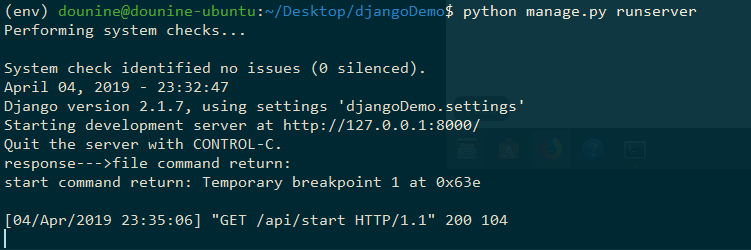

## 1. 启动服务端

需要在linux环境下进行。

必须要先启动`gdb server`。

### 1.1. 启动 gdb server

进入`djangoDemo`项目根目录。

然后进入`gdb`：

```bash
$ gdb
```

在`gdb`命令行中输入：

```bash
source gdbServer.py
```

### 1.2. 启动 django

**重新打开一个shell**。

启动`python`虚拟环境。

再进入`djangoDemo`项目根目录，输入：

```bash
$ pip install -r requirements.txt
$ python manage.py runserver
```

## 2. 请求与响应

### 2.1. 访问 api

浏览器访问：`http://localhost:8000/api/start`

### 2.2. django 接受请求并转发到 gdb server

`djangoDemo/djangoDemo/urls.py`中定义一级路由：

```py
urlpatterns = [
    path('admin/', admin.site.urls),        # django自带
    path('hello/', hello_views.hello),      # 转移到 hello.views 模块的hello函数
    path('api/', include('api.urls')),      # 转移到 api.urls 模块
]
```

将`/api`路径的请求转发到`api.urls`模块。

`djangoDemo/api/urls.py`中定义了`/api`路径后的二级路由：

```py
urlpatterns = [
    path('', include(router.urls)),
    path('start', gdbConn.start),      # 转到 gdbConn.py 中的 start 函数
    path('continue', gdbConn.contin),
]
```

将`/api/start`请求转发到`gdbConn`模块中`start`函数。

`djangoDemo/api/gdbConn.py`中，定义了对应的请求处理函数：

```py
def start(request):
    # 创建一个socket对象，AF_INET指定使用IPv4协议(AF_INET6代表IPV6)，SOCK_STREAM指定使用面向流的TCP协议
    tcp_client_socket = socket(AF_INET, SOCK_STREAM)
    tcp_client_socket.connect((HOST, PORT)) # 连接gdb服务器

    command = 'start'
    tcp_client_socket.send(command.encode('utf-8')) # 将字符串进行字节编码，并发送出去
    resp = tcp_client_socket.recv(BUFSIZ)   # 接受服务器返回的字节
    resp_str = resp.decode('utf-8')         # 对字节进行解码
    print('response--->' + resp_str)
    tcp_client_socket.close()

    retMsg = {
        'code': 0,
        'message': resp_str,
    }
    return JsonResponse(retMsg)    # 返回一个json
```

该函数将接收到的请求，转发到`gdb server`端。

### 2.3. gdb server 端接受 django 请求并响应

`gdb server`编写在`djangoDemo/gdbServer.py`中。

其中，`main()`函数负责监听端口，获取请求内容，并响应。`GdbServer`类负责与`gdb`进行交互。

交互主要通过`gdb.execute()`函数进行。

## 3. 截图展示

启动gdb：


启动Django，访问api：


django 端反应：



gdb server 端反应：

